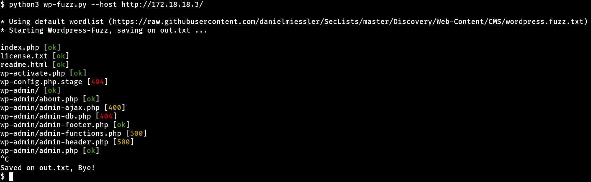

# Wordpress Fuzz
Python tool for fuzzing Wordpress websites.



## Instalation

``` 
pip install requests
curl https://raw.githubusercontent.com/entr0pie/wordpress-fuzz/main/wp-fuzz.py | tee wp-fuzz.py
```


## Usage
```
python3 wp-fuzz.py --host=http://your-blog.com/
python3 wp-fuzz.py --host=http://your-blog.com/ --wordlist=my-wordlist.txt
```

## Filtering Results
```
cat out.txt | fgrep -n "ok"  # 200 status code links.
cat out.txt | fgrep -nv "ok" # Pages that exist, but maybe aren't accesible.
cat out.txt | fgrep -n "403" # Forbidden pages.
```
